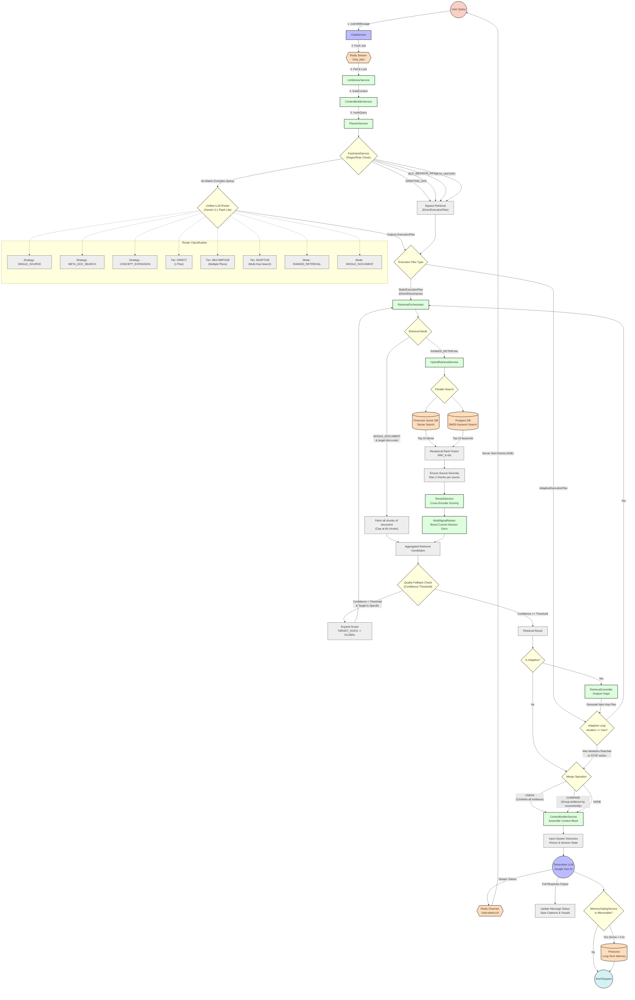

# Advanced RAG Pipeline & Agentic Workflow

This document provides a highly detailed, comprehensive node-and-edge diagram of the DocMind RAG architecture. It maps out the exact paths a query can take, every retrieval strategy, execution tiers, conditional fallback loops, rank fusions, and memory gating steps.

## Detailed Node & Edge Architecture Flow

## Advanced Pipeline Breakdown

### 1. Ingestion & Fast Routing
- The user query is picked up asynchronously from a Redis Stream. 
- The **FastIntentService** acts as a cheap regex-based guardrail. If the user just says "Hi" or asks "What can you do?", it bypasses the LLM router and vector search entirely to save compute, immediately emitting a `DirectExecutionPlan`.

### 2. Unified LLM Routing (Gemini 3.1 Flash Lite)
For complex queries, a small, fast LLM acts as the router to output a structured JSON plan:
- **Strategy Classifications:**
  - `SINGLE_SOURCE`: Standard factual lookup.
  - `META_DOC_SEARCH`: Searching *about* documents (e.g., "Which files discuss X?").
  - `CONCEPT_EXPANSION`: Expanding abstract concepts (e.g., "resilience") into multiple concrete keyword searches.
- **Execution Tiers:**
  - `DIRECT`: Resolves in one pass.
  - `DECOMPOSE`: Multiple queries run in parallel (e.g., comparing two distinct entities).
  - `ADAPTIVE`: A goal-oriented loop where the agent assesses findings and launches secondary queries if data is missing.
- **Retrieval Modes:**
  - `RANKED_RETRIEVAL`: The standard approach.
  - `WHOLE_DOCUMENT`: Used if the user explicitly wants to review an entire specific file.

### 3. Hybrid Retrieval & Orchestration
If not running a `WHOLE_DOCUMENT` fetch, the orchestrator triggers the `HybridRetrievalService`:
- It performs a **parallel search** against Pinecone (Dense Embeddings) and Postgres (BM25 Keywords).
- **Reciprocal Rank Fusion (RRF):** Fuses both lists (top 15 each) by calculating `1 / (RRF_K + rank)`. This surfaces results found by both engines to the top without being skewed by incompatible scoring scales.
- **Source Diversity:** A hard constraint algorithm guarantees no single document floods the results by capping it at 2 chunks per source in the initial pool.

### 4. Reranking & Quality Fallbacks
- The diverse candidate pool passes through a **Cross-Encoder** (`RerankService`) to calculate exact semantic relevance.
- The `MultiSignalRanker` applies a soft multiplier to chunks that originated in the *current session*, prioritizing actively discussed files without hard-filtering company-wide knowledge.
- **Scope Expansion (Agentic Fallback):** If the top candidate score falls below `RetrievalProperties.getPrimaryThreshold()`, and the query was artificially restricted to a specific document, the Orchestrator automatically rewrites the plan to search the `GLOBAL_CORPUS` and retries retrieval.

### 5. Adaptive Loop (Agentic Flow)
If the tier is `ADAPTIVE`, the `RetrievalController` inspects the initial results:
- If evidence is missing or partial, it reasons about the gap and generates a *new* target query to fetch missing information.
- This loop continues until it reaches an `AdaptiveActionType.STOP` state or hits the maximum allowed iterations.

### 6. Assembly & Context Merging
Based on the `MergeOperation` defined by the router (`UNION` or `COMPARE`), the chunks are stringified into a citation-aware XML-like block. The final prompt combines:
- Active File/Session metadata.
- Up to 10 previous conversation turns.
- System instructions tailored to the chosen retrieval strategy (e.g., instructing the LLM to deduce implicit themes for `CONCEPT_EXPANSION`).

### 7. Streaming & Memory Injection
Tokens are streamed real-time back to the user over Redis Pub/Sub -> SSE. Finally, the interaction is passed to the `MemoryGatingService`. If the generated answer is substantive (and retrieved context was highly relevant), the `User-Assistant` conversational pair is stored into a dedicated Pinecone index for long-term user profile memory.
